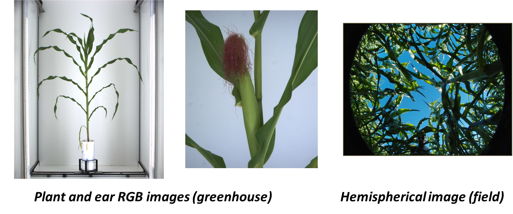
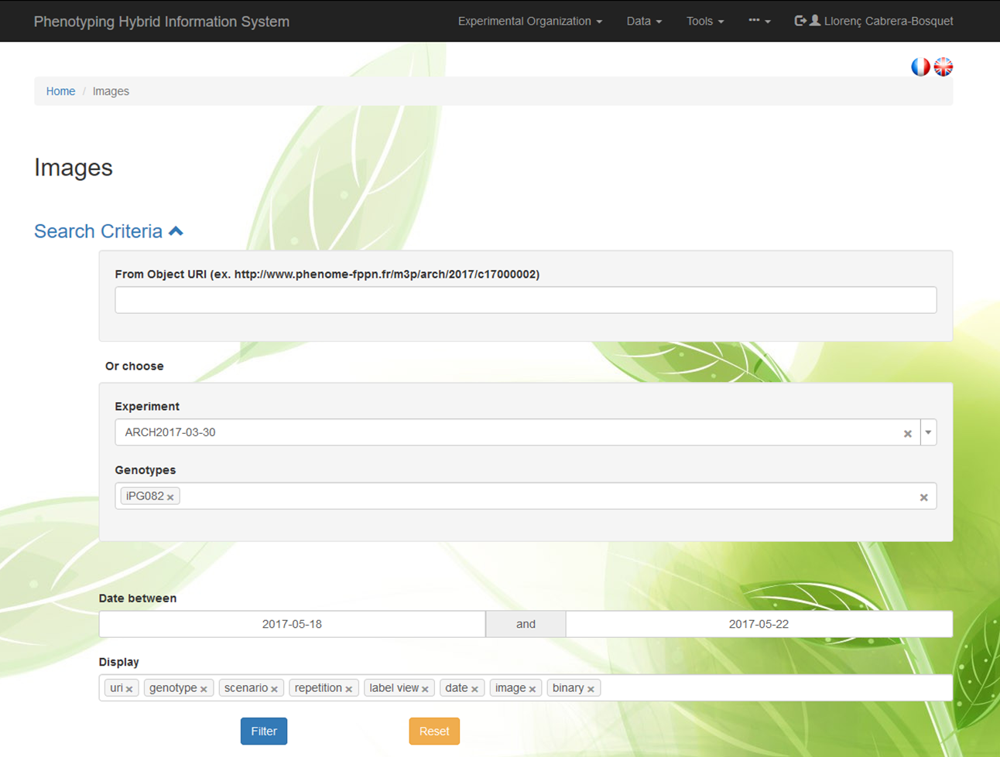
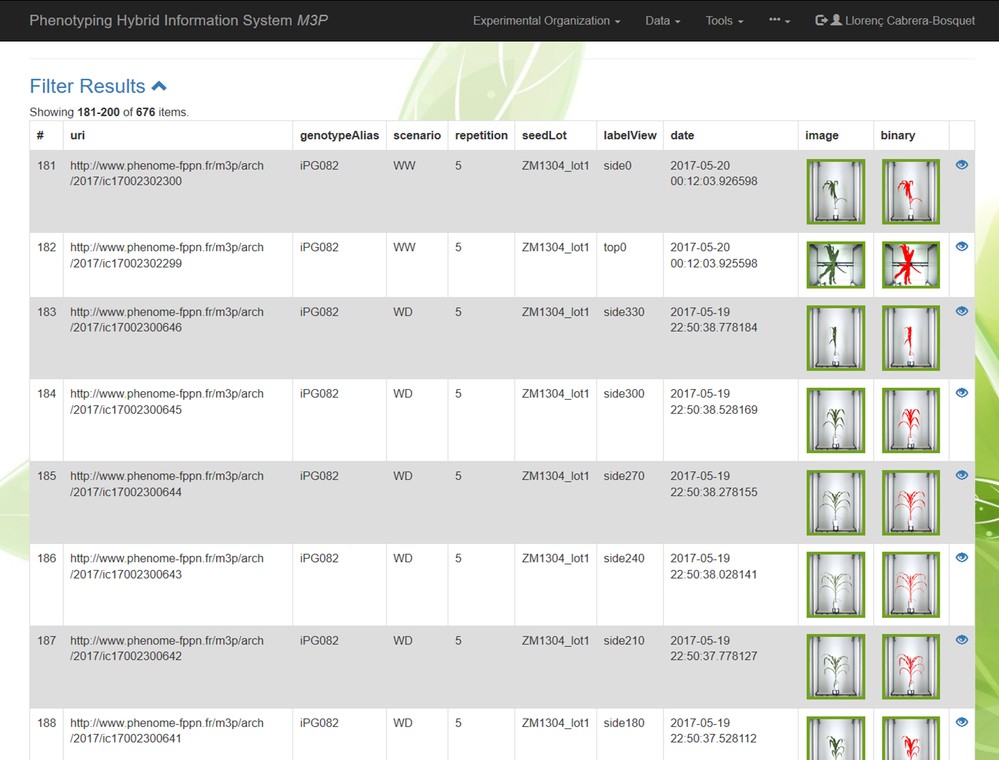
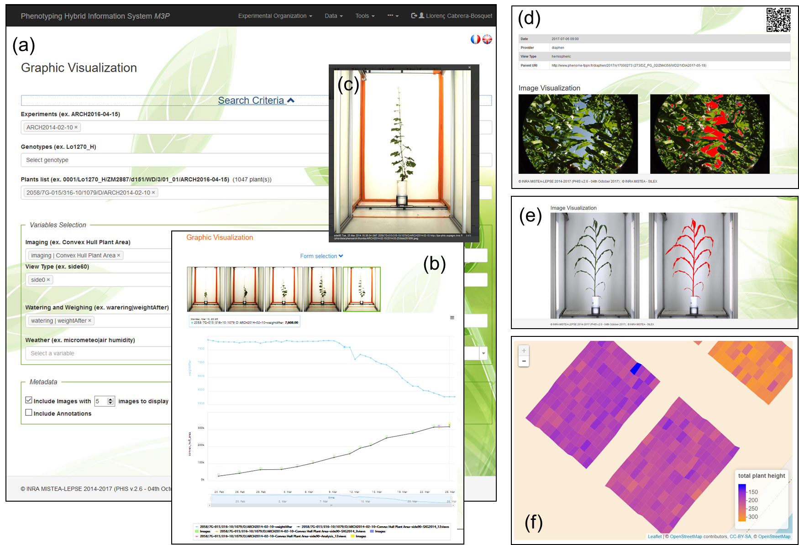
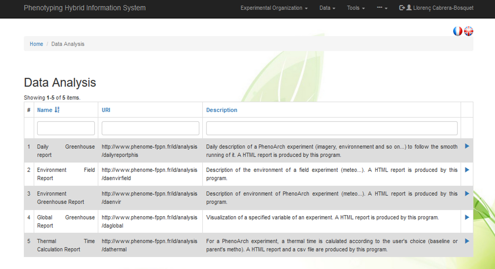
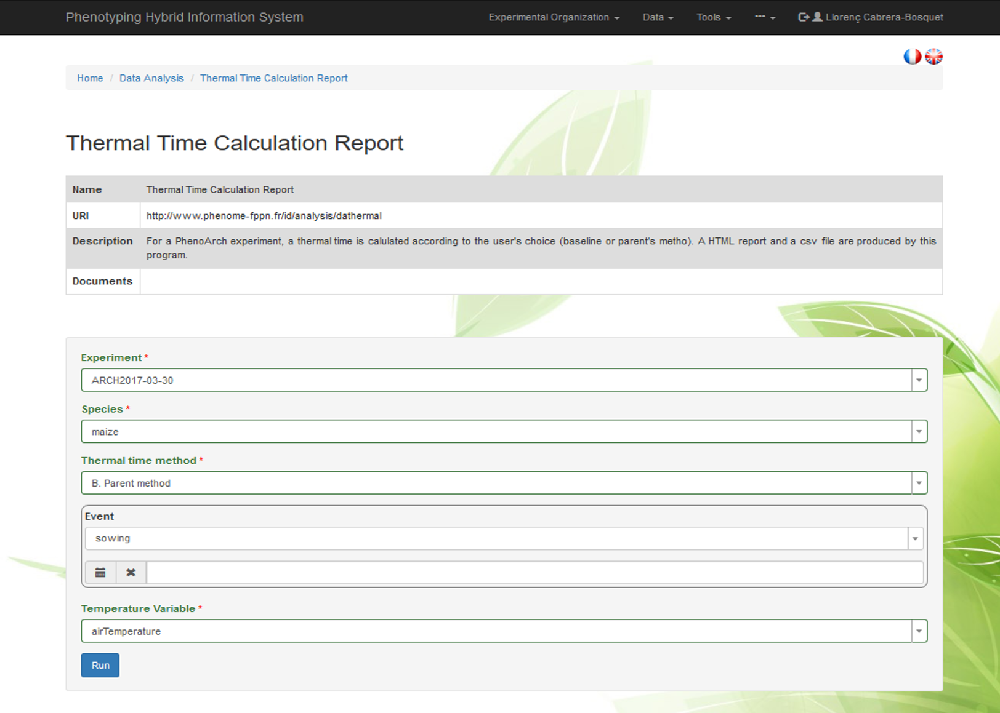
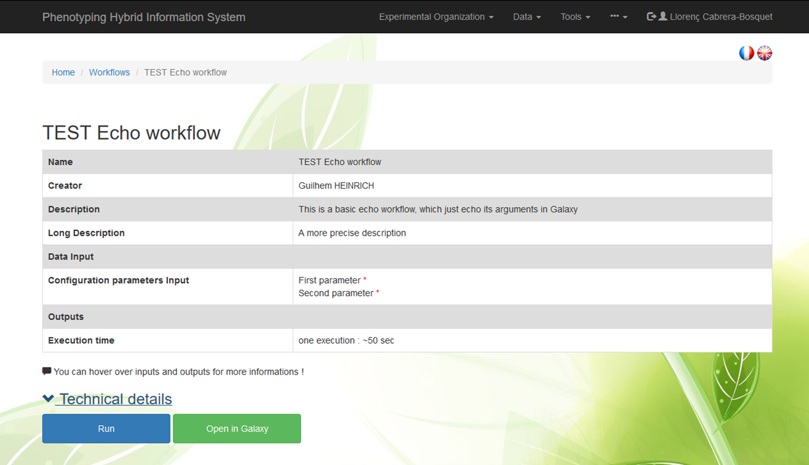
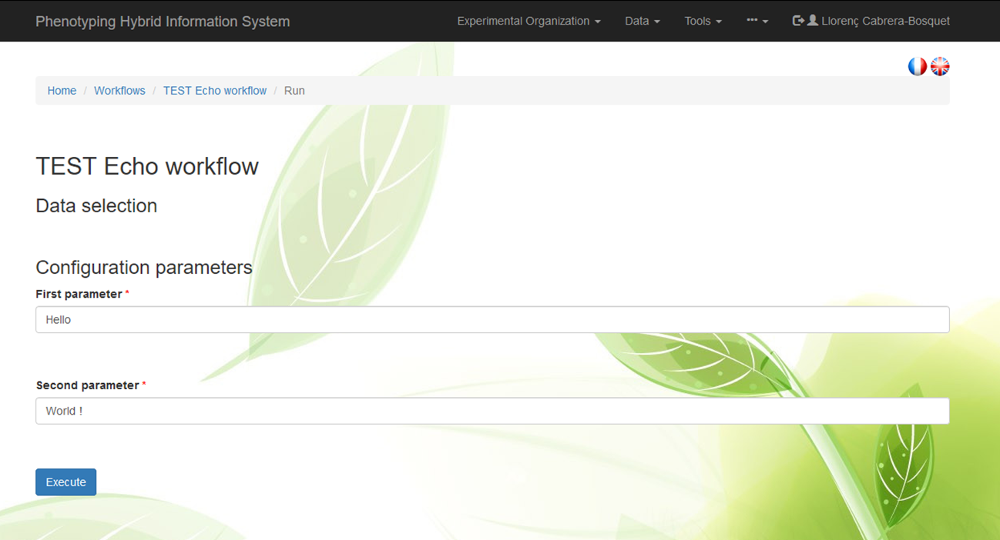

# Data menu

The Data menu contains tools for advanced data querying, visualization features for displaying images and time courses of phenotypic and environmental variables and scientific computing features including data analysis tools and integration of workflows.

## Images

Raw images (e.g. RGB, hemispherical,...), thumbnails and analysed images (e.g. segmented images) stored on the distributed storage system [**iRODS**](https://irods.org/ "iRODS"), can be accessed using a filtering form based on `URIs`, `Experiments`, `Genotypes` and `Dates`

Images can be displayed together different fields including:

`uri`, `experiment`, `genotype`,`scenario`,`repetition`,`seedlot`, `camera angle`,...

Results of image analysis can be displayed by chossing the option `binary` in the filter `Fields to display`

Images can be displayed and scrolled by clicking in the <a href="#">  </a> icon

## Search raw data

Advanced data querying allows rapid and efficient visualisation of images and monitoring variables guided by filtering tools based on semantics and rules such as mathematical operators.

## Graphic visualisation

The graphic visualisation menu contains features for displaying images, dynamic graphs of static or time courses of phenotypic and environmental variables, which are automatically adapted to the particular experimental settings and variables, such as greenhouse or field. For instance, the users may request a dynamic visualization of image analyses and watering results based on different filtering options (image angles, genotypes, plants, treatments). Such interactive figures allow exploring dynamic variables over time (e.g. plant area or water-use).

Graphs can be zoomed into a particular time window, and clicking on a data point automatically displays the images associated to this point together with the associated annotations. Raw images, segmented images and metadata can be displayed in both field and greenhouse experiments. The interaction with the knowledge layer allows projecting variables using GPS coordinates associated to plants or plots in field experiments and linking data with environmental sensor outputs.

Graphs can be exported into different formats (i.e. PDF, JPG, PNG, SVG).

## Data Analysis

PHIS includes extensible scientific computing modules based on R packages for calculating elaborated variables and generating experimental summaries and reports. Automatic reporting is based on data query through the interface and R integration in text processing ([**R Markdown**](https://rmarkdown.rstudio.com/ "R Markdown")). Different R ([**R Core Team, 2015**](https://www.r-project.org/ "R project")) packages (‘*dplyr*’, ‘*mongolite*’, ‘*RPostgreSQL*’, ‘*jsonlite*’, ‘*httr*’, ‘*urltools*’) are also used to  link databases and the Web User Interface. Basic reports include daily, weekly or final overviews of experiments, with standard statistics and graphic visualization of averaged queried traits. Extended reports may include specific calculation of traits and environmental conditions associated to a given plant or genotype. In particular, new variables can be calculated for a given experiment based on the joint use of phenotypic and environmental data together with associated metadata to plants and traits (e.g. events, methods).

For instance, a `Thermal Time Calculation Report` allows calculating the progression of thermal time for each `experiment`, taking into account diffrent parameters like the `species`, the `method` used (e.g. baseline temperature or Parent *et al*. method1) the `event` to start computation (e.g. sowing, emergence,thinning) or a given calendar date, and `temperature data` (air or leaf temperatures)

## Workflows

Workflow feature icluded in PHIS enables computational analysis and workflows through the scientific platform [**Galaxy**](https://galaxyproject.org/ "Galaxy project").

As an exemple  the simple Workflow `TEST Echo workflow` is shown, containing different attributes and input parameters:

[1Parent *et al*. 2010. Modelling temperature-compensated physiological rates, based on the co-ordination of responses to temperature of developmental processes. *Journal of Experimental Botany* 61: 2057-2069](https://doi.org/10.1093/jxb/erq003 "Parent et al. 2010")
