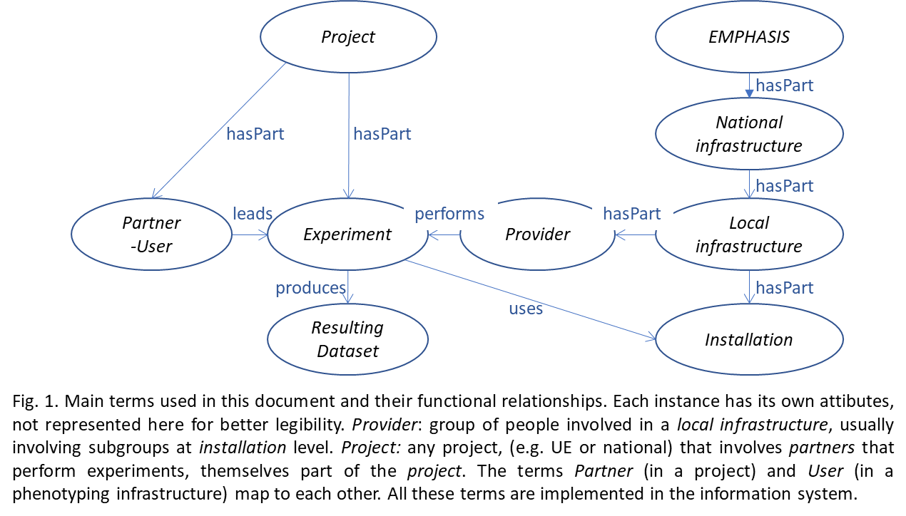

# Ontology of objects involved in Phenotyping

January 2018

EMPHASIS, WP4 (*F. Tardieu, X. Draye, R. Pieruschka, C. Pommier and P. Neveu main authors, with participation of P.E. Alary, M. Janni, M. Morrisse, T. Pridmore, B. Usadel and D. Wells*).

The ESFRI listed project EMPHASIS aims at a synergistic development and long-term operation of plant phenotyping infrastructure in Europe [https://emphasis.plant-phenotyping.eu/](https://emphasis.plant-phenotyping.eu/) by developing tools and methods for multi-scale phenotyping, allowing one to analyze genotype performance and trait diversity in current and future European environmental conditions. EMPHASIS aims at:

- Developing an integrated pan-European network of instrumented phenotyping platforms able to test genotypes in a diversity of agro-climatic scenarios, in controlled and field conditions.
- Linking data acquisition to a European-level data management system and to state-of-the art crop models to simulate plants and crops in current and future climates.
- Developing, evaluating and disseminating novel technologies, thereby providing new opportunities to European SMEs involved in phenotyping and precision agriculture.

This document proposes an ontology of objects involved in EMPHASIS and the rationale for the proposed choices. It follows discussions within the consortium and will be periodically re-assessed. Hereafter, all italicized terms correspond to controlled vocabulary, i.e. have a precise meaning that is defined at their first use (capitalized). They are used for the organisation of the EMPHASIS Information System and for communication in internal or external documents of the infrastructure. It is common with the I3 project EPPN2020,1, and participates to discussions in the frame of MIAPPE2.

## 1 MAIN DEFINITIONS

Distributed research infrastructures have different levels of organisation. Here we follow the general nomenclature provided by the EC,3,4 , adapted to plant phenotyping. Furthermore, the organization of information systems requires precise definitions of words frequently used as synonyms in common language, but that in fact correspond to different concepts and practical uses. We attempt here to define these terms and their relationships (Fig. 1)

### 1.1. National infrastructure

A `NATIONAL INFRASTRUCTURE` is an organized group of *local infrastructures* **(see §1.2)** with governance recognised by national authorities (e.g. respective ministry or national instance). Examples: DPPN [(http://www.dppn.de/dppn/EN/Home/)](http://www.dppn.de/dppn/EN/Home/), Component *local infrastructures* share rules or guidelines for user access **(see §1.3.1)** and cost calculation, common scientific and industry advisory boards and often common funding. They usually share a common e-infrastructure connecting their information systems with common tools (e.g. ontologies) and web services. *National infrastructures* are currently in development in several countries, with different modes of organisation and governance.

### 1.2. Local infrastructure

A `LOCAL INFRASTRUCTURE` is a group of *installations* **(see §1.3)** located in one site depending on one institution (or more), which share governance committees, a common (or at least highly interoperable) information system, common principles for cost calculation and pricing and a common tool for user *access*. Examples: M3P at INRA Montpellier [(https://www.phenome-fppn.fr/phenome_eng/)](https://www.phenome-fppn.fr/phenome_eng/), IBG-2: Plant Sciences at Foschungszentrum Jülich [(http://www.fzjuelich.de/ibg/ibg-2/EN/Home/home_node.html)](http://www.fzjuelich.de/ibg/ibg-2/EN/Home/home_node.html). A *local infrastructure* may have its own committees such as a Scientific Advisory Board or an Industrial Advisory Board. The latter can also be at *national infrastructure* level.

### 1.3. Experiments and projects

A `PROJECT` (e.g. EU or national projects) involves `PARTNERS` that are in charge of *experiments* (see below) performed in different *local infrastructures*. A project often involves specific ontologies or
methods, which can be defined automatically in information systems for all experiments part of the project. Some projects provide access to *installations*, e.g. EPPN2020. An `EXPERIMENT` is an action carried out by a given set of persons on a given set of observation unit, like plants or microplots **(see §2.1)**, involving a protocol, methods and a resulting dataset. *Experiments* are carried out by partners of a *project*, who are `USERs`, i.e. a group of persons who uses one or more *installations* **(see §1.5)**.

### 1.4. Activities

*Activities* involve **(i)** `DEEP PHENOTYPING`5, usually performed at organ level with a resolution of a few micrometers – millimetres. It most often involves short *timescales* (weeks) and timesteps (minutes to day) and medium capacity (tens to hundreds of plants) (see §2.1 for definitions). It can involve measurements such as local fluxes, organ anatomy or high definition expansion rate. **(ii)** `HIGH THROUGHPUT PHENOTYPING`5 in field or controlled conditions involves measurements of integrative traits of *plants* or *micro-plots* such as plant height, biomass, transpiration, 3-D architecture or leaf area, possibly with functional imaging such as multi-spectral or fluorescence imaging. It involves a capacity of thousands of *plants* or *micro-plots*, allowing genetic analyses such as genome wide association studies or genomic prediction. **(iii)** `NETWORKS OF FIELD EXPERIMENTS`5 involve tens of fields in a region following environmental gradients (e.g. north-south, oceanic – continental) in which one performs `LEAN PHENOTYPING` (defined here as the collect of yield components, simple traits, observations and/or images of outlier plants and environmental conditions). Each of these activities can generate novel traits.

### 1.5 Installation

An `INSTALLATION` is the elementary level for data acquisition. It stands for other frequently used terms such as ‘platform’, ‘plateau’, ‘facility’ or others. Examples: Phenoarch, Growscreenrhizo or others belonging to the EMPHASIS or EPPN2020 lists [(https://www.plantphenotyping.org/db_infrastructure#/)](https://www.plantphenotyping.org/db_infrastructure#/).

A given *experiment* **(see § 1.3.1)** can involve one or several *installations* in controlled conditions (*plants* can move between *installations*) or in the field **(see § 2.3)**. For the organization of information systems and calculation of costs, it is convenient to consider that each activity and each location such as field or greenhouse can involve several *installations* which are frequently handled by different groups of people and involve different pieces of equipment. This allows identification of common operations (with common items in information systems and common procedures for evaluation of costs), for example in fields with high throughput phenotyping and in *networks of field experiments* with lean phenotyping. With this definition, an installation usually involves instances that produce and handle the data as a result of *experiments* and *projects* and *activities*:

- A set of non- or minimally invasive instruments operated in an automated or semi-automated mode such as **(i)** `SENSORs`, i.e. device providing numerical data, e.g. environment sensors or cameras, **(ii)**
`VECTORs` i.e. devices that either transport plants to a given site for phenotyping, or carry sensors in a greenhouse (e.g. conveyor belt, gripping arm, robot) or in the field (e.g. UAV, gantry, field robot).
By extension, a vector can also be a group of persons producing hand observations.
- A management and operating team, `ACCESS PROVIDER`, i.e. an organized group of people who perform experiments together with users, handle equipment and uses a dedicated set of pipelines and procedures for the analysis of the data originating from the *installation*.
- A set of methods and designs available for experiments.
- A set of methods for data handling and analysis, including image and data analysis pipelines.
- A connection with an information system, usually but not necessarily situated at a higher level (typically the *local infrastructure*).

*Installations* are also considered as elementary units for which cost calculation can be defined (e.g. investment, personnel cost, maintenance, data storage, data analysis etc.). User access can be managed at the *installation*, *local infrastructure* or *national infrastructure* levels depending on the mode of organisation at the national level. It is managed on a `UNIT ACCESS` base (e.g. per day x duration of *experiment*, per flight or ground passage etc.).

## 2 FEATURES OF INSTALLATIONS AND OF RESULTING DATASETS

### 2.1 Main attributes of installations in field and controlled conditions

`SCALES` include *spatial* and *temporal* domains that are often interlinked. The `TEMPORAL SCALE` covers processes that range from fraction of second e.g. electron transport, day e.g. developmental processes and season e.g. growth dynamics and yield. The `SPATIAL SCALES` of plant organization analysed in EMPHASIS are `ORGAN` (any part of the plant that presents defined boundaries and is defined by a specific ontology), `PLANT` (the organism originating from a single seed, callus, rhizome or any other propagation mean) and `PLOT` (a community of plants located on a defined area of a field). The cellular scale is essentially carried out by other infrastructures. Field experiments usually refer to `MICRO PLOT`, i.e. a portion of the experimental field with a common genotype and set of cultivation techniques. These *scales* correspond to the `OBSERVATION UNITS` defined in MIAPPE, i.e. the level at which traits are measured, calculated and stored in the information system.

The methods and techniques to capture `ENVIRONMENTAL CONDITIONS` are a key attributes of any *installation*. The latter are defined as a matrix of values of `ENVIRONMENTAL VARIABLES` (outputs of a *sensor* with appropriate units, e.g. temperature, °C) collected at given `TIME STEPS` (the interval between two measurements, e.g. 10 minutes) over a `TIMESCALE` (the time during which an experiment is carried out, e.g. 2 months). The elementary attributes of an *environmental variable* are the category of *sensor*, its make, age, and calibration. The position of sensors is another essential attribute (e.g. x-y-z position in a greenhouse, GPS coordinates in a field in which z stands for the altitude of atmospheric *sensors* and depth for soil*sensors*). `ENVIRONMENTAL METADATA` are the collection of attributes, timesteps and timescales used in a particular *experiment*. Those metadata will proposed for integration in a future version of MIAPPE.

*Environmental conditions* comprise raw data that depict the time-course of every variable, attached to each *sensor* (e.g. light or temperature every hour for a given sensor). They serve to calculate elaborate variables, for example the maximum /minimum /mean /median of all *sensors* outputs measuring a given variable, the number of hours with a temperature higher than a threshold or the light intensity per unit thermal time. Typically, raw variables are stored in information systems whereas elaborate variables are reported in the supplementary information of scientific papers. Indeed, the number of elaborate variable can be nearly infinite, depending on researcher’s interest so they cannot be stored in information systems. However, if an *installation* or a *project* use elaborate variables routinely, their definition, unit and mode of calculations (but not values) are traced in the corresponding information systems.

Other attributes of a given *installation* are its `CAPACITY` (the number of plants or micro-plots that can be handled simultaneously in one experiment) and `THROUGHPUT` (the number of plants or microplots handled per unit time). The *annual throughput* indicates the amount of plants handled in a given *installation* in one year. Throughputs over shorter periods (e.g. day), together with the capacity of the installation, are the main determinants of the frequency of phenotypic measurements (reciprocal of *timestep* for phenotypic measurements).

### 2.2 Resulting datasets in controlled conditions

*Controlled conditions installations* involve both `HIGH PRECISION PLATFORMS`5 for *deep phenotyping* and *controlled conditions platforms* for *high throughput phenotyping*^5. They are hosted in climate chambers or greenhouses. Common characteristics of controlled conditions *installations* involve an *annual throughput* between hundreds and thousands of plants. This allows genetic analyses of measured traits based on one or several *experiments* and corresponds to a capacity of hundreds of plants in *high-precision platforms*, thousands in *high throughput controlled conditions platforms*. Typical datasets of *experiments* in controlled conditions involve:

- Detailed measurement of *environmental conditions* with distributed *sensors* in different locations, and x-y maps of each measured variable in the greenhouse or growth chamber, for estimating the conditions sensed by each plant. These maps can originate from physical or statistical models. *Controlled conditions installations* can manipulate one or more *environmental conditions* such as varying light, temperature, water, nutrient or CO2 availability.
- Images and *sensor* outputs. Imaging may involve active and passive methods with different wavebands for quantitative assessment of *organs* or *whole plants* (in some cases *canopies*) gathering structural and functional data on shoot and root architecture, biomass and growth rates, photosynthesis and nutrient relations. Meta-data include the type and calibration of cameras and sensors, the timing of imaging and environmental conditions during imaging (if different from those in the greenhouse or growth chamber). For the analysis of pathological (pests or pathogens) and beneficial interactions with other biota, novel sensors estimate temporal and spatial variations of number of spores and bacteria in air and soil and the progress of diseases can be tracked via imaging approaches.
- Specific experimental designs and protocols, in particular the spatial arrangement of plants (including its change with time if any), *timesteps* of the environmental or phenotypic measurements, plant handling (e.g. planned and effective dates of irrigation or treatments)
- Precise recording of phenology, i.e. dates of main steps in the plant cycle (in time or thermal time) and the collection of `EVENTs` (e.g. accidents, visual observations on outlier plants etc.).
- The protocols used for loading data into an information system.

### 2.3 Installations and resulting datasets in field experiments

*Field experiments* can either be stand-alone (e.g. *intensive fields* with *high throughput phenotyping*) or be part of a *network of field experiments* with *lean phenotyping*5. It is convenient to consider that a *field experiment* involves several *installations*, which are frequently handled by different groups of people and involve different pieces of equipment.

#### 2.3.1 Basic field installations

The *basic field installation* is a field site carrying out *lean phenotyping*, which can be either part of a *network of field experiments*, or one of the activities in an *intensive field*. This *installation* is equipped with *environmental sensors*, material for cultivation techniques and for precision harvest at microplot level. It is most often handled by a group of people that differs from those handling other *installations* involved in field experiments. Datasets associated with *basic field installations/lean phenotyping* involve the same data and meta-data in *intensive fields* and in *networks of field experiments*, namely:

- Knowledge of the spatial distribution of the physical properties of the considered field (e.g. fieldlevel maps of soil type, soil depth of profile, water reserve etc.).
- *Environmental conditions* recorded at each time step of the experiment by each *sensor* in different locations characterizing the above- and below-ground environment during *experiments*, together with environmental metadata depicting the categories and makes of *sensors*, their spatial positions (GPS), their age and calibrations.
- Manual environmental measurements at beginning and end of *experiments* (e.g. vertical distribution of soil water or nutrient status.
- Experimental design and protocol, in particular a map of the spatial arrangement of *microplots*.
- *Cultivation techniques* e.g. dates of irrigation, pest control, weed control.
- Precise recording of phenology, i.e. dates of main steps in the plant cycle expressed in time or thermal time (sowing, emergence, flowering, maturity) and, potentially, of manual measurements such as SPAD.
- *Events* (e.g. hail, pest attack, wind episode causing lodging etc.) and record of obvious gradients or outliers.

#### 2.3.2 Other specific field installations define the attributes of intense fields

In the view presented here, a given field experiment involves different *installations* with many possible combinations of them (e.g. basic field *installation* + UAV in one field, and basic field installation + FACE + Phenomobile in another field). Identifying *installations* in this way greatly facilitates the organization of information systems and data analysis.

*Installations allowing environmental manipulations* contain equipment that allow comparison of plant behavior in either normal or manipulated conditions in the same field. This can involve rainout shelters which protect *plots* during rain episodes, FACE that enrich the air with CO2 or other gases, local heaters for increasing canopy temperature or equipment for (fert-)irrigation with high precision. Many of these *installations* can be moved periodically from one field to another, so they need to be considered as *installations* per se, regardless of the field where they are installed. They usually involve specific personnel able to handle this equipment. Datasets associated with these *installations* are specific environmental data (e.g. high definition of maps of temperature or CO2 in the *installation* every day or hour). Metadata involve the characteristics of equipment and events (e.g. dates and volume of irrigation or timing of rainout shelter opening/closing).

*Plant imaging installations* consists of a set of equipment, including imaging *sensors*, vectors (e.g. gantry, phenomobile or UAV), a management and operation team, and standardized methods and procedures for data handling, storage and analysis. They are characterized by the throughput of the considered vector (e.g. thousands of microplots day-1 for automated phenomobiles and UAVs) and the set of devices used for active and passive methods with different wavebands (e.g. cameras with RGB or thermal infrared wavebands, LiDars, fluorescence cameras). Except in the case of fields equipped with gantries, these *installations* are most often involved in several field experiments during the same crop season, so they need to be considered as *installations* per se. For both information system and calculation of costs, it is convenient to consider activities such as UAV and phenomobile imaging as different *installations*, even when they operate in the same field. Indeed, each of them correspond to specific equipment, operators and have different unit access bases (e.g. flight for UAV, day for a phenomobile). Datasets associated with these *installations* are images of one *microplot* at a given time characterized by GPS coordinates of the *microplot* and timing of images. Metadata are the characteristics of the device, the make, age and calibration of each sensor or camera and events such as defects or breakdown of a sensor.

Most often, elaborate protocols for imaging or environmental manipulations require a record of phenology more precise than in **§2.3.1** (e.g. number of appeared leaves or phenology scale designed for a given species), which can be performed either on a reference genotype or on all genotypes.
Other *installations* can be defined as allowing any other operation involving specific equipment, group of people and methods. For example, the ability to apply a parasite or fungus can be considered as an *installation* involving equipment and methods for the application, *sensors* measuring the concentration of spores or bacteria in the air above the field every hour and the skills for the operation.

## 3. MODELLING INSTALLATIONS (needs reworking)

A `MODELLING INSTALLATION` consists of a particular type of model (climate, process-based crop model, structural, functional-structural), developed, maintained and preferentially distributed and
supported by a dedicated team of developers, managers, operators, and potentially linked to *controlled conditions installations* and/or *field installations*, and data analysis pipelines. These
*installations* are not necessarily situated in the same *local infrastructure*. *Modelling installations* support phenotyping activities via at least three categories of models.

**3.1.** `COMPONENT TRAIT MODELS` are used to aid in the genetic and physiological dissection of complex traits in field and/or controlled conditions (e.g. patterns of responses to water deficit
across environmental gradients in mapping populations) into component traits. The exploitation of dense and high resolution characterizations of phenotypes and environments (from phenotyping *installations*) with component trait models helps dissect complex traits into their physiological/genetic components. This process (`MODEL-ASSISTED PHENOTYPING`) is very close to plant (eco-)physiology and very often leads to (re-)formulation of component trait models. Process-based and functional structural plant models are cornerstones in the dissection of field traits using phenotypic data obtained in platforms.

**3.2.** Various models are used to compute sophisticated information from raw sensor data (`MODEL-ENABLED PHENOTYPING`) captured in phenotyping installations. An example of this is the computation of individual plant light interception using radiation transfer models combined with virtual plant mockups (structural models) parameterized with images of the plant. Here, models are used or developed with a specific purpose of extracting hidden data.

**3.3.** `CROP MODELS` are used to simulate the behavior of large combinations of genotypes in diverse environmental scenarios. This gives the possibility of in silico testing of thousands of interesting allele combinations in the diversity of current and future European climates. *Crop models* able to reconstruct complex traits from component traits and to predict the behavior of novel genotypes in various  management x climate scenarios are the cornerstone of this process.

### References

1 https://EPPN2020.plant-phenotyping.eu/

2 https://github.com/MIAPPE

3 https://ec.europa.eu/research/infrastructures/index_en.cfm?pg=access

4 https://portal.meril.eu/meril/4 https://ec.europa.eu/research/.../2016_charterforaccessto-ris.pdf

5 F. Tardieu, L. Cabrera-Bosquet, T. Pridmore, M. Bennett. 2017. Plant Phenomics, From Sensors to Knowledge. *Current Biology*, 27  R770-R783.
