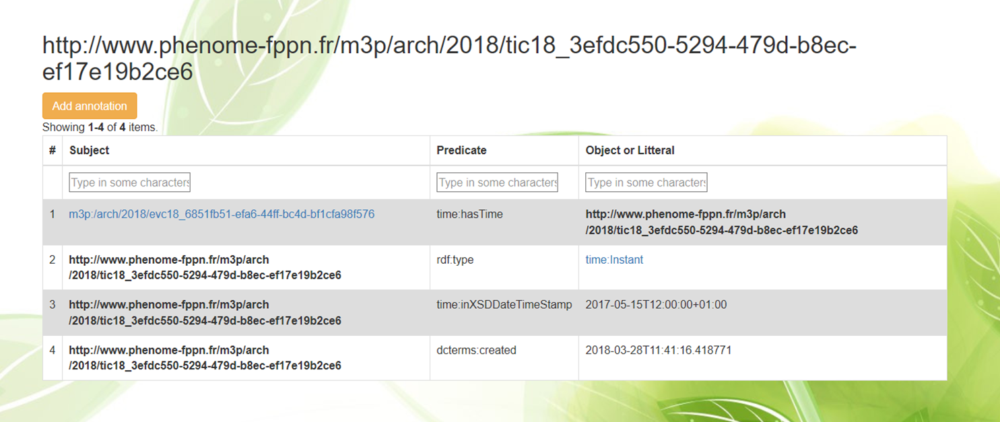
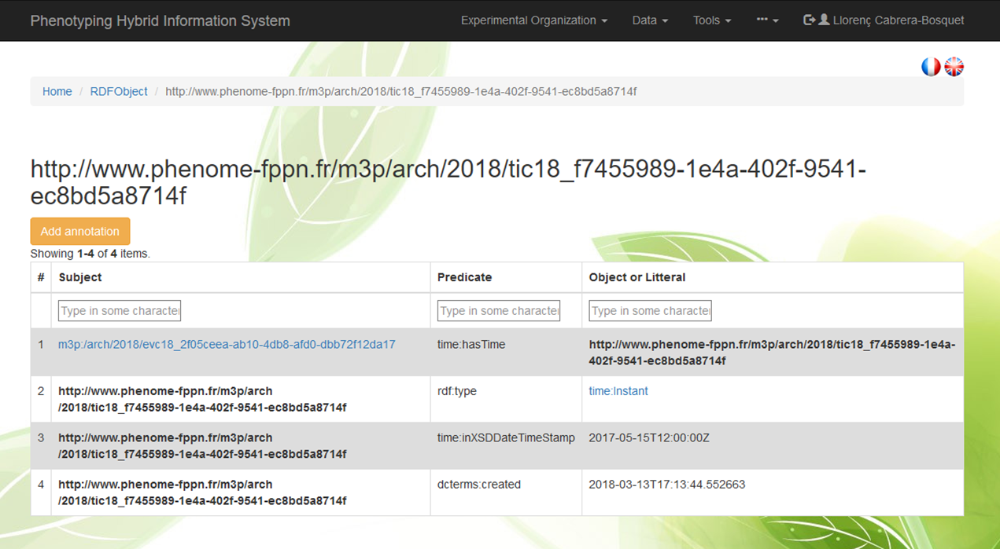

# Events and Annotations

The Events menu allows searching and visualising events and annotations performed in the different objects declared in the information system.

Different filters can be applied based on `Dates`, `Type`, `Description` of events or the `Concern` object. As an example, searching for plant 795 (having the URI `m3p:/arch/2017/c17000795`) in the **Concern** box, results in five different events describing *sowing*, *thinning*, *installation of plant tutors*, an *incident* ocurred during imaging and *harvesting*:


Detailed information of each event can be displayed including [**RDF triples**](https://www.w3.org/RDF/). For instance the event `http://www.phenome-fppn.fr/m3p/arch/2018/evc18_6851fb51-efa6-44ff-bc4d-bf1cfa98f576` describing the `Harvesting` of plant 795 is formulated as:


 where is of type harvesting (**rdf:type**), concerns plant 795 (**event:concern**), and has and associated time stamp (**time:hasTime**). Details of the timings of the event (**time:inXSDDateTimeStamp**) and its annotation are described as:

 

The harvesting event `http://www.phenome-fppn.fr/m3p/arch/2018/evc18_6851fb51-efa6-44ff-bc4d-bf1cfa98f576` concerning the plant 795 is associated to the annotation `http://www.phenome-fppn.fr/m3p/arch/2018/oac18_eb34a5c1fb62027a5600680448f12e70` via **oa:hasTarget**. Details of the annotation, such as the type **oa:Annotation**, the **oa:bodyValue** '*Harvesting of the plant*' and the time that event was annotated (**dcterms:created**) and the person who did the annotation (**dctersms:creator**) are described below:



# Annotations

Annotations are mainly guided by the [**OEEv ontology**](ontologies#oeev) and the [**Web Annotation Data Model**](https://www.w3.org/TR/annotation-model/) that allows annotating any object declared in the system and assigning motivation and purpose attributes to annotations (e.g. oa:describing, oa:identifying, oa:linking, oa: replying, etc.). [**Dublin Core**](http://dublincore.org/) properties such as **dc:created** or **dc:creator** are also used. 

```
    'http://www.w3.org/ns/oa#describing' => 'oa:describing',
    'http://www.w3.org/ns/oa#identifying' => 'oa:identifying',
    'http://www.w3.org/ns/oa#moderating' => 'oa:moderating',
    'http://www.w3.org/ns/oa#assessing' => 'oa:assessing',
    'http://www.w3.org/ns/oa#bookmarking' => 'oa:bookmarking',
    'http://www.w3.org/ns/oa#classifying' => 'oa:classifying',
    'http://www.w3.org/ns/oa#commenting' => 'oa:commenting',
    'http://www.w3.org/ns/oa#editing' => 'oa:editing',
    'http://www.w3.org/ns/oa#highlighting' => 'oa:highlighting',        
    'http://www.w3.org/ns/oa#linking' => 'oa:linking',
    'http://www.w3.org/ns/oa#questioning' => 'oa:questioning',
    'http://www.w3.org/ns/oa#replying' => 'oa:replying',
    'http://www.w3.org/ns/oa#tagging' => 'oa:tagging',
    
```

Annotations can be added by clicking on the Annotation button <span class="btn btn-warning">Add Annotation</span> present in the different menus

