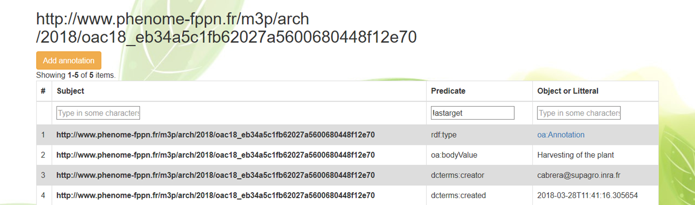

# Events

The Events menu allows searching and visualising events and annotations performed in the different objects.

Different filters can be applied. For instance, searching for the plant 795 having the URI `m3p:/arch/2017/c17000795`, results in four different events, each one characterised by a `Type`, `Description`, `Concern` and a `Date of event`.

Detailed information of each event can be displayed including RDF triples. For instance the event describing the `harvesting` of plant 795 is formulated as:

Thus, the event `http://www.phenome-fppn.fr/m3p/arch/2018/evc18_2f05ceea-ab10-4db8-afd0-dbb72f12da17` concerns the plant 795 (**event:concern**), is of type harvesting (**rdf:type**) and it happened at a give time (**time:hasTime**). Details of the time in which the event happened (**time:inXSDDateTimeStamp**) and the time that event was annotated (**dcterms:created**) are described below:

Further annotations can be added by clicking on the Annotation button Add Annotation 

Annotations are mainly guided by the OEEv ontology and the Web Annotation Data Model [(https://www.w3.org/TR/annotation-model/)](https://www.w3.org/TR/annotation-model/) that allows annotating any object declared in the system and assigning motivation and purpose attributes to annotations (e.g. oa:describing, oa:identifying, oa:linking, oa: replying, etc.)
