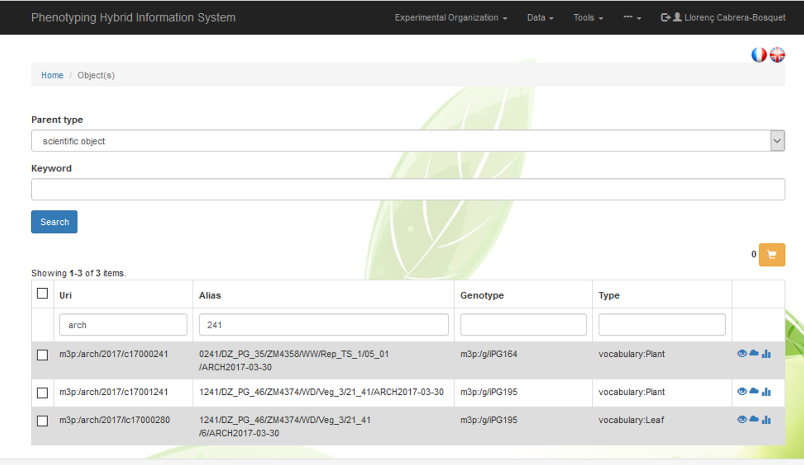
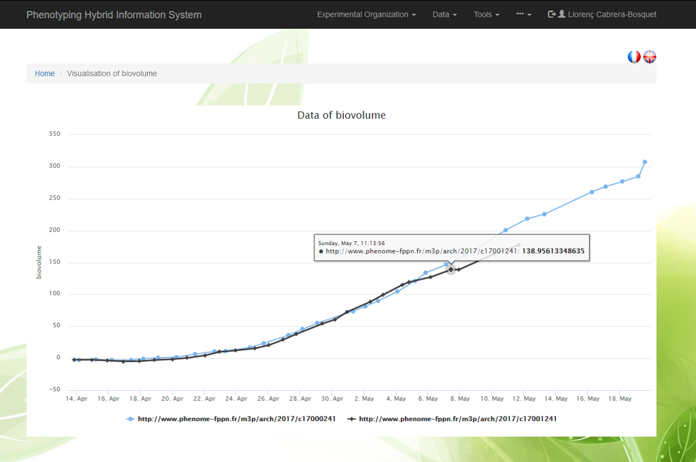

# Object tracking

The Experimental Organization menu contains a `Scientific Object Tracking tool`.

Searching filters allow selecting for scientfic objects such as plants, plots or organs or keywords.

 

  <label for="sel1">Parent type</label>
  <select class="form-control" id="sel1">
    <option>plant</option>
    <option>plot</option>
    <option>leaf</option>
    <option>ear inflorescence</option>
  </select>

 

  

  <label for="usr">Keyword</label>
  <input type="text" class="form-control" id="usr" placeholder="e.g. arch">

Search

For instance, the search of *arch* in the `Uri` box and *241* in the `Alias` box results in three different outputs:

| URI                       | Alias                                                 | Genotype      | Type             |
|---------------------------|-------------------------------------------------------|---------------|------------------|
| m3p:/arch/2017/c17000241  | 0241/DZ_PG_35/ZM4358/WW/Rep_TS_1/05_01/ARCH2017-03-30 | m3p:/g/iPG164 | vocabulary:Plant |
| m3p:/arch/2017/c17001241  | 1241/DZ_PG_46/ZM4374/WD/Veg_3/21_41/ARCH2017-03-30    | m3p:/g/iPG195 | vocabulary:Plant |
| m3p:/arch/2017/lc17000280 | 1241/DZ_PG_46/ZM4374/WD/Veg_3/21_41/6/ARCH2017-03-30  | m3p:/g/iPG195 | vocabulary:Leaf  |

Wheras the first two results correpond to plants (Type = vocabulary:Plant) the third result corresponds to a Leaf (Type = vocabulary:Leaf). Objects (either plants or leaves) have their own URI. 
The filtered objects can be individually selected by clicking on left boxes and are automatically placed in a basket for further analyses.

Selected objects can be visualised by clicking on the shopping car icon <a href="#" class="btn btn-warning"></a>

Once the objects are in the shopping car (i.e. plants *m3p:/arch/2017/c17000241* and *m3p:/arch/2017/c17001241*), different analyses ca be performed:

## Trait comparison

This feature allows different elaborated variables such as biovolume, leaf area or plant height to be compared between selected objects:
 

  <label for="sel1">Action</label>
  <select class="form-control" id="sel1">
    <option>Biovolume</option>
    <option>Leaf Area</option>
    <option>Plant height</option>
    <option>Thermal time</option>
  </select>

Execute command

## Object inspection

The different icons on the right side of each selected object allow different actions:

- 
<a href="#">  </a>: Allows browsing the object properties including annotations and events

- 
<a href="#">  </a>: Allows visualisation of environmental conditions sensed by each object  

- 
<a href="#">  </a>: Allows visualisation of different time courses of traits 

### RDF details

Detailed information of object characteristics and annotations or events is displayed in the form of RDF triples (subject - predicate - object):

- `http://www.phenome-fppn.fr/m3p/arch/2017/c17000241` `rdf:type` `vocabulary:Plant` represents plant 241 is of type plant
- `http://www.phenome-fppn.fr/m3p/arch/2017/c17000241`	`vocabulary:hasRepetition`	`1` represents plant 241 has rep 1
- `http://www.phenome-fppn.fr/m3p/arch/2017/c17000241`	`vocabulary:withinPot`	`m3p:/arch/2017/pc17000000741` represents plant 241 is in pot #741

### Environmental conditions

This feature allows to follow the environmental conditions sesnsed by a given plant. This is of particular interest when plants are transfered between installations or compartments with different environmental conditions. In the exemple presented here, `plant 241` is sequentially monitored in two installations over 50 days. The experiment takes place in `Installation 1` [(**http://www.phenome-fppn.fr/m3p/phenoarch**)](https://www6.montpellier.inra.fr/lepse_eng/M3P/PHENOARCH-platform "PHENOARCH platform") for daily measurements of biovolume and transpiration, and then the plant is moved to `Installation 2` [(**http://www.phenome-fppn.fr/m3p/phenodyn**)](https://www6.montpellier.inra.fr/lepse_eng/M3P/PHENODYN-platform "PHENODYN platform") for ten days where was subjected to a thermal stress (May 19 to May 29) before being harvested. As shown in the graph below, environmental conditions sensed by the plant largely differ between the two installations, so a proper tracking tool is essential.

IMAGE!!

### Time courses of variables

For instance `biovolume` over time can be displayed together with the annotations and events (e.g. sowing, harvesting) that occured to a given plant:

Events displayed in green boxes along the time axis can be explored by clicking on. For instance, clicking on the box displaying `Harvesting of the plant` allows exploring all the information related to such event:

