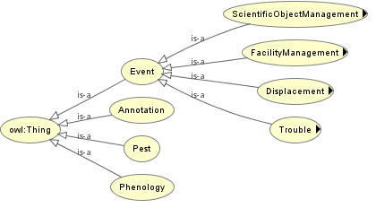

# Ontologies

PHIS relies on two application ontologies compliant with the standards of Ontology Web Language [(OWL)](https://www.w3.org/OWL/). The ontologies are available at the Agroportal (xxxxxxxxx).

## OEPO

The Ontology for Experimental Phenotypic Objects (OEPO), allows assigning types (e.g. Experimental organization and context, Environment type, Germplasm, Physical Object) to objects involved in phenotyping experiments and defining specialization hierarchy between them according to the specificities of the installations and experiments.

## OEEv

The Ontology of Experimental Events (OEEv), characterises events that occur during an experiment, e.g. moving of plants, dates of sowing, application of a given treatment, harvesting, measurements or sampling for -omic measurements, or any category of technical problem.

