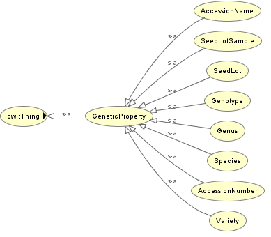

# Ontologies

PHIS relies on two application ontologies compliant with the standards of Ontology Web Language [(OWL)](https://www.w3.org/OWL/). The ontologies are available at the Agroportal (xxxxxxxxx).

## OEPO

The Ontology for Experimental Phenotypic Objects (OEPO), allows assigning types (e.g. Experimental organization and context, Environment type, Germplasm, Physical Object) to objects involved in phenotyping experiments and defining specialization hierarchy between them according to the specificities of the installations and experiments.

The OPEPO ontology contains three main groups ob objects, namely *Experimental Context*, *Scientific Objects* and *Genetic Properties*. 

The *Experimental context* refers to the set of environmental conditions, infrastructure and supporting equipment or resources necessary to conduct a given experiment.

For instance, a *device* is a sub-category of *equiment* containing *vectors*, *actuators* and *sensing devices*

- *Vectors* are *devices* that either transport plants to a given site for phenotyping, or carry sensors in a greenhouse (e.g. conveyor belt, gripping arm, robot) or in the field (e.g. UAV, gantry, field robot).
By extension, a vector can also be a group of persons producing hand observations.

- *Actuators* are *devices* 

- *Sensing devices* are *devices* providing numerical data, e.g. environment sensors or cameras. Environmental sensors follow the Semantic Sensor Network Ontology (http://purl.oclc.org/NET/ssnx/ssn).

- *Scientific objects* correspond to the different plant organization levels studied such as whole plants (the organism originating from a single seed, callus, rhizome or any other propagation mean), or plots (a community of plants located on a defined area of a field), but also other concepts defined at lower spatial sclae (e.g. leaf, silk, ear Inflorescence). Terms present in this ontology map onto existing ontologies providing relevant concept hierarchies related to the anatomy, structure and phenotype of plants described in the Planteome project1 [http://planteome.org/](http://planteome.org/) such as the Crop Ontology2 [(http://cropontology.org/)](http://cropontology.org/), the Plant Ontology3,4,5 [(http://plantontology.org/)](http://plantontology.org/), the PATO [(http://www.obofoundry.org/ontology/pato.html)](http://www.obofoundry.org/ontology/pato.html), and other ontological resources such as the AGROVOC6.

- Genetic material. The FAO/Bioversity Multi Crop Passport Descriptors is also used for germplasm identification.

## OEEv

The Ontology of Experimental Events (OEEv), characterises events that occur during an experiment, e.g. moving of plants, dates of sowing, application of a given treatment, harvesting, measurements or sampling for -omic measurements, or any category of technical problem.

### References

1Cooper L, Meier A, Laporte MA, Elser JL, Mungall C, Sinn BT, Cavaliere D, Carbon S, Dunn NA, Smith B, et al. 2018. The Planteome database: an integrated resource for reference ontologies, plant genomics and phenomics. Nucleic Acids Research 46: D1168-D1180.

2Shrestha R. 2012. Bridging the phenotypic and genetic data useful for integrated breeding through a data annotation using the CropOntology developed by the crop communities of practice. Frontiers in Physiology 3.

3Cooper L, Walls RL, Elser J, Gandolfo MA, Stevenson DW, Smith B, Preece J, Athreya B, Mungall CJ, Rensing S. 2013. The plant ontology as a tool for comparative plant anatomy and genomic analyses. Plant and Cell Physiology 54: e1-e1.

4Ilic K, Kellogg EA, Jaiswal P, Zapata F, Stevens PF, Vincent LP, Avraham S, Reiser L, Pujar A, Sachs MM, et al. 2007. The plant structure ontology, a unified vocabulary of anatomy and morphology of a flowering plant. Plant Physiology 143: 587-599.

5Walls RL, Athreya B, Cooper L, Elser J, Gandolfo MA, Jaiswal P, Mungall CJ, Preece J, Rensing S, Smith B. 2012. Ontologies as 
integrative tools for plant science. American Journal of Botany 99: 1263-1275.

6Caracciolo C, Stellato A, Morshed A, Johannsen G, Rajbhandari S, Jaques Y, Keizer J. 2013. The AGROVOC linked dataset. Semantic Web 4: 341-348.