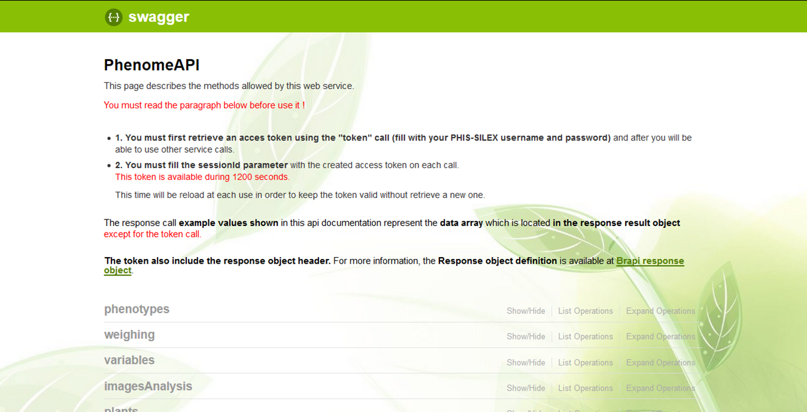
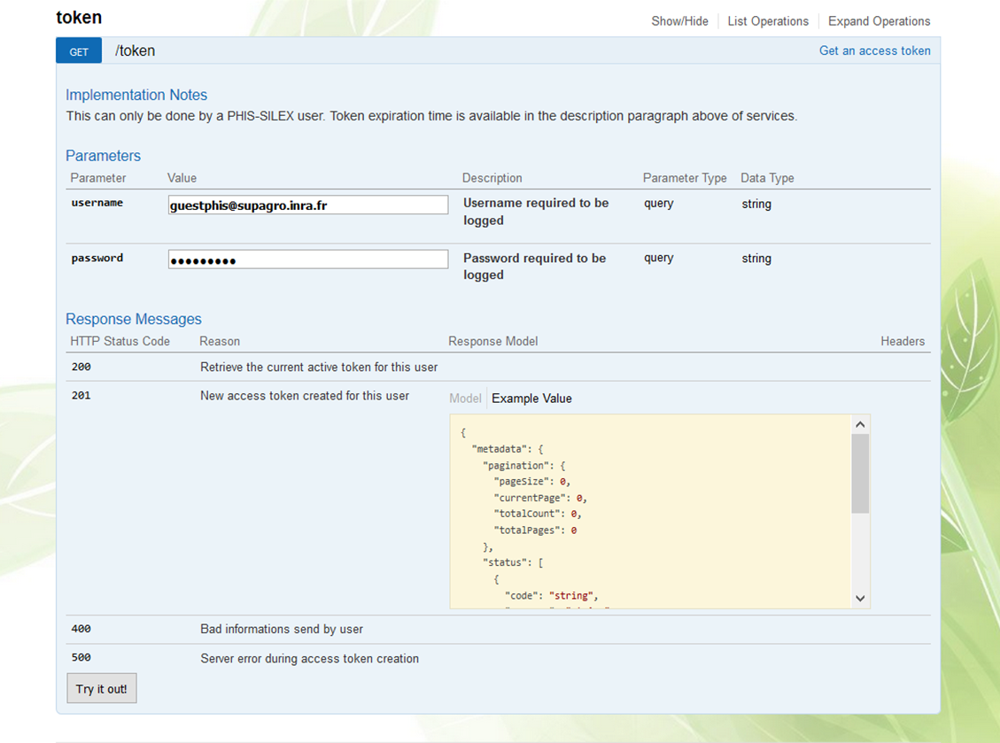
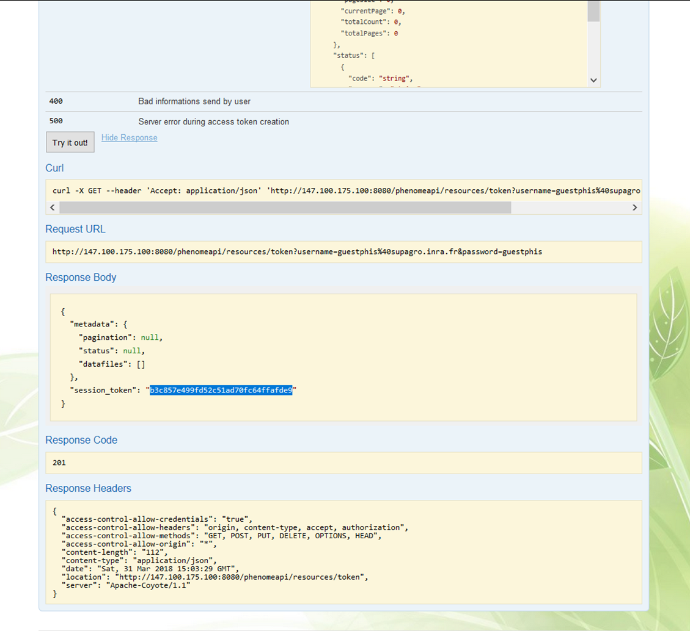

# Web Service API

The web service API enables interoperability and data exchange with other applications and systems. The web service  is based on RESTFul (Representational state transfer) developed using [**Swagger framework**](https://swagger.io/ "Swagger") and all services are available by using URIs. It is developed in Java with Jersey implementation of JAX-RS (Java API for RESTful Web Services) standard. It implements the [**Breeding API (BrAPI)**](http://www.brapi.org/ "BrAPI"), which specifies a standard interface for plant phenotype databases to serve data to crop breeding applications. Web service outputs use the data-interchange format JSON (JavaScript Object Notation). The Web services and access are described at [**http://web.supagro.inra.fr/phis/phenomeapi/api-docs/**](http://web.supagro.inra.fr/phis/phenomeapi/api-docs/) and are available to authorized client programs.



## Getting access rights

The first step to get access to web service consists in retrieving an acces token using the "token" call. 
A PHIS username and password is necessary to get the token.



#### cURL (client URL request library)

```javascript
curl -X GET --header 'Accept: application/json' 'http://147.100.175.100:8080/phenomeapi/resources/token?username=guestphis%40supagro.inra.fr&password=guestphis'
```

#### Request URL

```javascript
http://147.100.175.100:8080/phenomeapi/resources/token?username=guestphis%40supagro.inra.fr&password=guestphis

```

#### Response body

```json
{
  "metadata": {
    "pagination": null,
    "status": null,
    "datafiles": []
  },
  "session_token": "5f5a2947f4b7a567d4b0fbae4e5db7e9"
}

```
2. You must fill the sessionId parameter with the created access token on each call.



In the example shown here the "session_token": "b3c857e499fd52c51ad70fc64ffafde9"

This token is available during 1200 seconds. This time will be reloaded at each use in order to keep the token valid without necessity to retrieve a new one.

GET, POST, PUT

## Use case

GET image analysis data

#### cURL (client URL request library)

```
curl -X GET --header 'Accept: application/json' 'http://147.100.175.100:8080/phenomeapi/resources/imagesAnalysis?experimentURI=http%3A%2F%2Fwww.phenome-fppn.fr%2Fm3p%2FARCH2017-03-30&pageSize=20&page=0&sessionId=5f5a2947f4b7a567d4b0fbae4e5db7e9'
```

#### Request URL

```
http://147.100.175.100:8080/phenomeapi/resources/variables/category/imagery?experimentURI=http%3A%2F%2Fwww.phenome-fppn.fr%2Fm3p%2FARCH2017-03-30&pageSize=20&page=0&sessionId=5f5a2947f4b7a567d4b0fbae4e5db7e9
```

#### Response body

```json
{
  "metadata": {
    "pagination": {
      "currentPage": 0,
      "pageSize": 20,
      "totalCount": 5164424,
      "totalPages": 258222
    },
    "status": null,
    "datafiles": []
  },
  "result": {
    "data": [
      {
        "plantURI": "http://www.phenome-fppn.fr/m3p/arch/2017/c17000100",
        "experimentURI": "http://www.phenome-fppn.fr/m3p/ARCH2017-03-30",
        "imageUri": "http://www.phenome-fppn.fr/m3p/arch/2017/ic17002281951",
        "labelView": "side240",
        "date": "2017-05-18 05:55:06.818+02:00",
        "variableCodeId": "objectSumArea_computed_unspecified",
        "value": 177448,
        "confidence": "unspecified",
        "stationId": 6
      },
      {
        "plantURI": "http://www.phenome-fppn.fr/m3p/arch/2017/c17000100",
        "experimentURI": "http://www.phenome-fppn.fr/m3p/ARCH2017-03-30",
        "imageUri": "http://www.phenome-fppn.fr/m3p/arch/2017/ic17002281951",
        "labelView": "side240",
        "date": "2017-05-18 05:55:06.818+02:00",
        "variableCodeId": "numberOfObjects_computed_objects",
        "value": 16,
        "confidence": "unspecified",
        "stationId": 6
      },
      {
        "plantURI": "http://www.phenome-fppn.fr/m3p/arch/2017/c17000100",
        "experimentURI": "http://www.phenome-fppn.fr/m3p/ARCH2017-03-30",
        "imageUri": "http://www.phenome-fppn.fr/m3p/arch/2017/ic17002281951",
        "labelView": "side240",
        "date": "2017-05-18 05:55:06.818+02:00",
        "variableCodeId": "heightUnderPot_computed_pixels",
        "value": 0,
        "confidence": "unspecified",
        "stationId": 6
      },
      {
        "plantURI": "http://www.phenome-fppn.fr/m3p/arch/2017/c17000100",
        "experimentURI": "http://www.phenome-fppn.fr/m3p/ARCH2017-03-30",
        "imageUri": "http://www.phenome-fppn.fr/m3p/arch/2017/ic17002281951",
        "labelView": "side240",
        "date": "2017-05-18 05:55:06.818+02:00",
        "variableCodeId": "plantHeight_computed_pixels",
        "value": 1278,
        "confidence": "unspecified",
        "stationId": 6
      },
      {
        "plantURI": "http://www.phenome-fppn.fr/m3p/arch/2017/c17000100",
        "experimentURI": "http://www.phenome-fppn.fr/m3p/ARCH2017-03-30",
        "imageUri": "http://www.phenome-fppn.fr/m3p/arch/2017/ic17002281951",
        "labelView": "side240",
        "date": "2017-05-18 05:55:06.818+02:00",
        "variableCodeId": "convexHullArea_computed_square pixels",
        "value": 1254718,
        "confidence": "unspecified",
        "stationId": 6
      },
      {
        "plantURI": "http://www.phenome-fppn.fr/m3p/arch/2017/c17000100",
        "experimentURI": "http://www.phenome-fppn.fr/m3p/ARCH2017-03-30",
        "imageUri": "http://www.phenome-fppn.fr/m3p/arch/2017/ic17002281951",
        "labelView": "side240",
        "date": "2017-05-18 05:55:06.818+02:00",
        "variableCodeId": "plantWidth_computed_pixels",
        "value": 1237,
        "confidence": "unspecified",
        "stationId": 6
      },
      {
        "plantURI": "http://www.phenome-fppn.fr/m3p/arch/2017/c17000100",
        "experimentURI": "http://www.phenome-fppn.fr/m3p/ARCH2017-03-30",
        "imageUri": "http://www.phenome-fppn.fr/m3p/arch/2017/ic17002281951",
        "labelView": "side240",
        "date": "2017-05-18 05:55:06.818+02:00",
        "variableCodeId": "convexHullPlantPerimeter_computed_pixels",
        "value": 4191.808,
        "confidence": "unspecified",
        "stationId": 6
      },
      {
        "plantURI": "http://www.phenome-fppn.fr/m3p/arch/2017/c17000100",
        "experimentURI": "http://www.phenome-fppn.fr/m3p/ARCH2017-03-30",
        "imageUri": "http://www.phenome-fppn.fr/m3p/arch/2017/ic17002281951",
        "labelView": "side240",
        "date": "2017-05-18 05:55:06.818+02:00",
        "variableCodeId": "heightOverPot_computed_pixels",
        "value": 1279,
        "confidence": "unspecified",
        "stationId": 6
      },
      {
        "plantURI": "http://www.phenome-fppn.fr/m3p/arch/2017/c17000100",
        "experimentURI": "http://www.phenome-fppn.fr/m3p/ARCH2017-03-30",
        "imageUri": "http://www.phenome-fppn.fr/m3p/arch/2017/ic17002281950",
        "labelView": "side210",
        "date": "2017-05-18 05:55:06.568+02:00",
        "variableCodeId": "objectSumArea_computed_unspecified",
        "value": 188795,
        "confidence": "unspecified",
        "stationId": 6
      },
      {
        "plantURI": "http://www.phenome-fppn.fr/m3p/arch/2017/c17000100",
        "experimentURI": "http://www.phenome-fppn.fr/m3p/ARCH2017-03-30",
        "imageUri": "http://www.phenome-fppn.fr/m3p/arch/2017/ic17002281950",
        "labelView": "side210",
        "date": "2017-05-18 05:55:06.568+02:00",
        "variableCodeId": "numberOfObjects_computed_objects",
        "value": 11,
        "confidence": "unspecified",
        "stationId": 6
      },
      {
        "plantURI": "http://www.phenome-fppn.fr/m3p/arch/2017/c17000100",
        "experimentURI": "http://www.phenome-fppn.fr/m3p/ARCH2017-03-30",
        "imageUri": "http://www.phenome-fppn.fr/m3p/arch/2017/ic17002281950",
        "labelView": "side210",
        "date": "2017-05-18 05:55:06.568+02:00",
        "variableCodeId": "heightUnderPot_computed_pixels",
        "value": 0,
        "confidence": "unspecified",
        "stationId": 6
      },
      {
        "plantURI": "http://www.phenome-fppn.fr/m3p/arch/2017/c17000100",
        "experimentURI": "http://www.phenome-fppn.fr/m3p/ARCH2017-03-30",
        "imageUri": "http://www.phenome-fppn.fr/m3p/arch/2017/ic17002281950",
        "labelView": "side210",
        "date": "2017-05-18 05:55:06.568+02:00",
        "variableCodeId": "plantHeight_computed_pixels",
        "value": 1298,
        "confidence": "unspecified",
        "stationId": 6
      },
      {
        "plantURI": "http://www.phenome-fppn.fr/m3p/arch/2017/c17000100",
        "experimentURI": "http://www.phenome-fppn.fr/m3p/ARCH2017-03-30",
        "imageUri": "http://www.phenome-fppn.fr/m3p/arch/2017/ic17002281950",
        "labelView": "side210",
        "date": "2017-05-18 05:55:06.568+02:00",
        "variableCodeId": "convexHullArea_computed_square pixels",
        "value": 938293.5,
        "confidence": "unspecified",
        "stationId": 6
      },
      {
        "plantURI": "http://www.phenome-fppn.fr/m3p/arch/2017/c17000100",
        "experimentURI": "http://www.phenome-fppn.fr/m3p/ARCH2017-03-30",
        "imageUri": "http://www.phenome-fppn.fr/m3p/arch/2017/ic17002281950",
        "labelView": "side210",
        "date": "2017-05-18 05:55:06.568+02:00",
        "variableCodeId": "plantWidth_computed_pixels",
        "value": 932,
        "confidence": "unspecified",
        "stationId": 6
      },
      {
        "plantURI": "http://www.phenome-fppn.fr/m3p/arch/2017/c17000100",
        "experimentURI": "http://www.phenome-fppn.fr/m3p/ARCH2017-03-30",
        "imageUri": "http://www.phenome-fppn.fr/m3p/arch/2017/ic17002281950",
        "labelView": "side210",
        "date": "2017-05-18 05:55:06.568+02:00",
        "variableCodeId": "convexHullPlantPerimeter_computed_pixels",
        "value": 3664.2532,
        "confidence": "unspecified",
        "stationId": 6
      },
      {
        "plantURI": "http://www.phenome-fppn.fr/m3p/arch/2017/c17000100",
        "experimentURI": "http://www.phenome-fppn.fr/m3p/ARCH2017-03-30",
        "imageUri": "http://www.phenome-fppn.fr/m3p/arch/2017/ic17002281950",
        "labelView": "side210",
        "date": "2017-05-18 05:55:06.568+02:00",
        "variableCodeId": "heightOverPot_computed_pixels",
        "value": 1299,
        "confidence": "unspecified",
        "stationId": 6
      },
      {
        "plantURI": "http://www.phenome-fppn.fr/m3p/arch/2017/c17000100",
        "experimentURI": "http://www.phenome-fppn.fr/m3p/ARCH2017-03-30",
        "imageUri": "http://www.phenome-fppn.fr/m3p/arch/2017/ic17002281949",
        "labelView": "side180",
        "date": "2017-05-18 05:55:06.318+02:00",
        "variableCodeId": "objectSumArea_computed_unspecified",
        "value": 153087,
        "confidence": "unspecified",
        "stationId": 6
      },
      {
        "plantURI": "http://www.phenome-fppn.fr/m3p/arch/2017/c17000100",
        "experimentURI": "http://www.phenome-fppn.fr/m3p/ARCH2017-03-30",
        "imageUri": "http://www.phenome-fppn.fr/m3p/arch/2017/ic17002281949",
        "labelView": "side180",
        "date": "2017-05-18 05:55:06.318+02:00",
        "variableCodeId": "numberOfObjects_computed_objects",
        "value": 10,
        "confidence": "unspecified",
        "stationId": 6
      },
      {
        "plantURI": "http://www.phenome-fppn.fr/m3p/arch/2017/c17000100",
        "experimentURI": "http://www.phenome-fppn.fr/m3p/ARCH2017-03-30",
        "imageUri": "http://www.phenome-fppn.fr/m3p/arch/2017/ic17002281949",
        "labelView": "side180",
        "date": "2017-05-18 05:55:06.318+02:00",
        "variableCodeId": "heightUnderPot_computed_pixels",
        "value": 0,
        "confidence": "unspecified",
        "stationId": 6
      },
      {
        "plantURI": "http://www.phenome-fppn.fr/m3p/arch/2017/c17000100",
        "experimentURI": "http://www.phenome-fppn.fr/m3p/ARCH2017-03-30",
        "imageUri": "http://www.phenome-fppn.fr/m3p/arch/2017/ic17002281949",
        "labelView": "side180",
        "date": "2017-05-18 05:55:06.318+02:00",
        "variableCodeId": "plantHeight_computed_pixels",
        "value": 1319,
        "confidence": "unspecified",
        "stationId": 6
      }
    ]
  }
}
```
